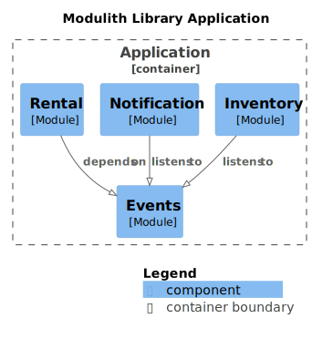

# 📚 Spring-Modulith Library App

**Modular Monolith Library Management System**  
Built using Spring Boot, Spring Modulith & Domain‑Driven Design  
Domains: **Rental**, **Inventory**, **Notifications**

---

## Introduction

This repository contains a **sample Library Management System** built with **Spring Modulith**. It demonstrates how to structure a Spring Boot application into **modular components** with **clearly defined context boundaries**, adhering to **Domain-Driven Design (DDD)** principles.



## Key characteristics of this architecture:

- **Modular Design** – Each module encapsulates its own domain logic and data.
- **Inter‑module Communication** – Modules interact either **synchronously** via exposed APIs or **asynchronously** using domain events.
- **Loose Coupling** – Reduces dependencies between modules, improving maintainability and scalability.
- **Microservice‑ready** – Clear boundaries simplify transitioning from a monolithic architecture to distributed **microservices** as the system evolves.

---

## 🔦 Why Spring Modulith?

- **Modular Monolith Architecture**: Encapsulate functional domains into modules (rental, inventory, notifications), improving maintainability and clarity.
- **Structural Verification**: Enforce module boundaries using `ApplicationModules.of(...).verify()` in tests, preventing illegal package dependencies.
- **Event‑Driven Communication**: Modules interact via domain events instead of direct service injection, leading to loose coupling and high cohesion.
- **Self‑Documenting Modules**: Automatically generate module documentation diagrams and artifacts via Spring Modulith tooling. [module-docs](docs)

---

## ⚙️ Workflow Overview

1. **Rental API Call**
    - `POST /api/rentals/rent` → RentalService persists rental and publishes `RentalEvent`.
   
    - `POST /api/rentals/return` → RentalService updates rental with return date time and publishes `ReturnEvent`.

2. **Inventory Listener**
    - Consumes `RentalEvent` → decrements available copies and publishes `RentalSuccessEvent`
    - Consumes `ReturnEvent` → increments available copies and publishes `ReturnSuccessEvent`.

3. **Notifications Listener**
    - Listens to both `RentalSuccessEvent` and `ReturnSuccessEvent` events and logs notification metadata (bookId, userId, timestamps).

---

## 📦 Key Features

- **Events driven side effects**: inventory updates and notifications handled asynchronously.
- **Modular isolation**: each domain encapsulates its own model and logic.
- **Automated architecture enforcement**: `module verify` tests catch coupling violations.

---

## 🧭 Benefits in Real–World Development
1. **Clean Domain Separation** – Each module owns its model and operations.

2. **Evolution‑Friendly Architecture** – Easy to add new modules or external integrations (e.g., Kafka, Email).

3. **Independent Testing** – Modules can be tested individually using @ApplicationModuleTests.

4. **Microservice Migration Ready** – Event-driven design simplifies extraction into microservices if needed.

## 🧪 Getting Started

### Prerequisites

- Java 17+
- Gradle (wrapper included) or Maven
- Postgres Database

### Clone & Run

```
git clone https://github.com/avidee007/spring-modulith-library-app.git
cd spring-modulith-library-app 
```
#### Build application

```bash
  ./gradlew build
```

#### Run application
```bash
  ./gradlew bootRun
```

#### Run tests
```bash
  ./gradlew test
```

